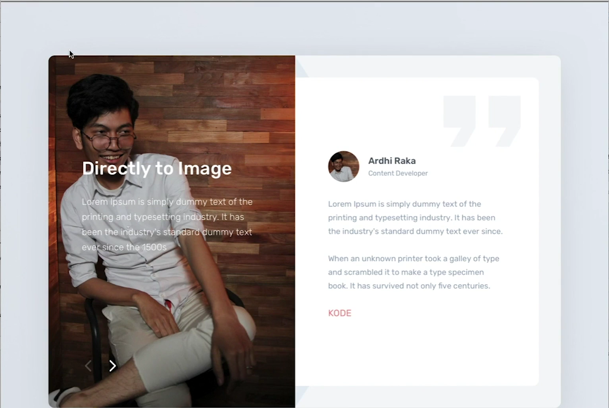
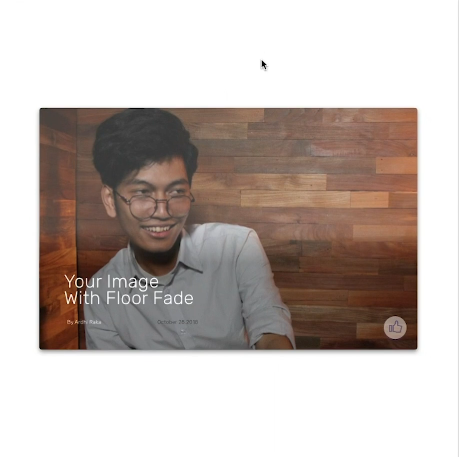

## Working with Images

Bagaimana bekerja dengan gambar dan tulisan agar lebih mudah dibaca dan terlihat jelas?

**Guidline :**

1. Overlay. Gunakan overlay untuk membuat background image menjadi lebih gelap dan tulisan menjadi jelas.

    

   

 

2. Box. Gunakan box untuk memperjalas tulisan dan gambar.

    

   

 

3. Blur. Gunakan blur untuk membuat gambar sedikit tidak terlihat jelas dan tulisannya terlihat jelas.

    

   

 

4. FloorFade. Gunakan metode floorfade untuk membuat gambar menjadi gradient seperti pada gambar dibawah.

    

   
