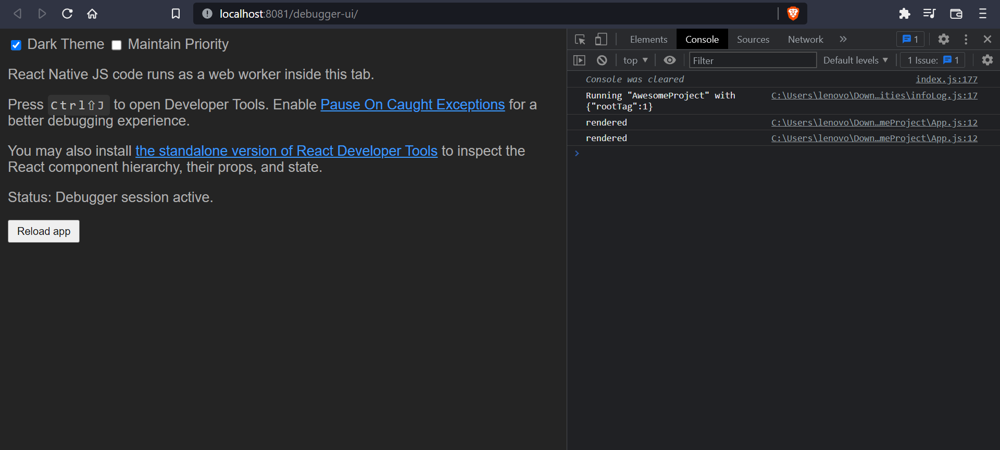
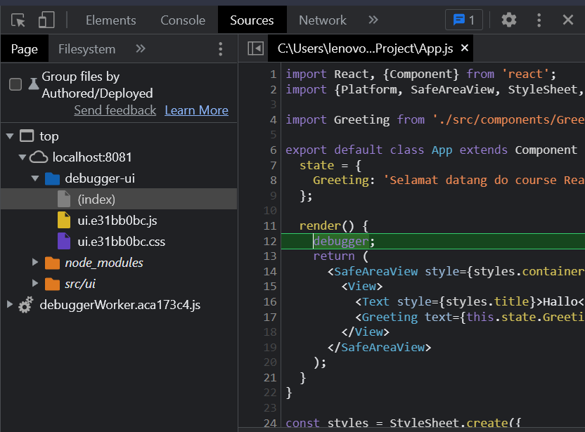
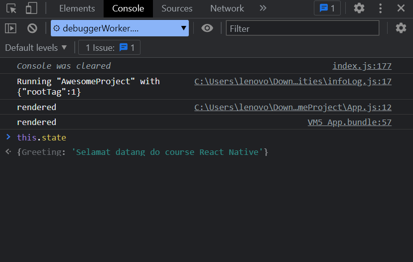

# Debug Remotly

1. Untuk dapat melakukan debugging pada aplikasi react native dapat menekan tombol `Ctrl + M` pada Android atau pada IOS bisa menekan `command + B`

   Pilih debugging pada emulator lalu akan menampilkan console pada browser.

   Ketikkan perintah dibawah `render()`
   `console.log('render')`

   

     
    2. Kita ingin melakukan breakpoint dengan perintah `debugger;` maka ketika reload akan berhenti pada render()

   

   Lalu kita bisa check pada state di console browser nya.

   
