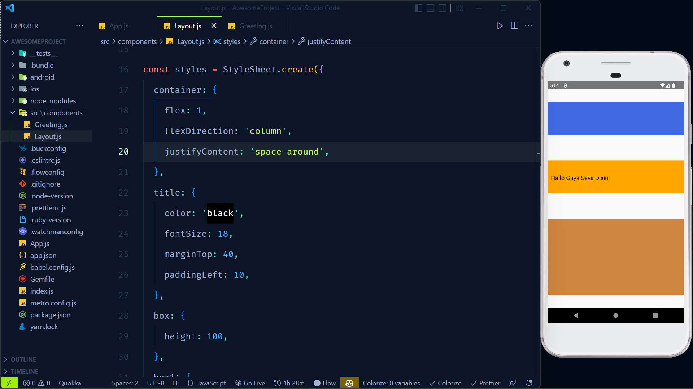

# Justify Content

1. Flex start : agar box menempel keatas.

2. Flex end : agar box menempel kebawh.

3. Flex center : untuk ketengah.

4. Space arround : untuk mendistribusikan jeda atau space yang merata.

5. Space between : untuk mendistribusikan jeda atau space antar elemen box.

    

   
