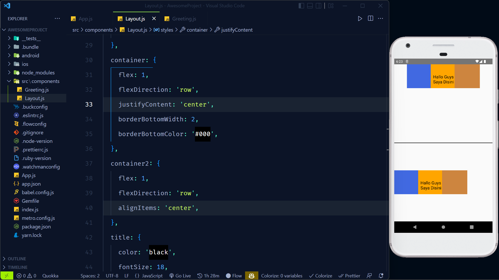

# Align Item

Sekilas justify content dan align item mirip, nilainya pun mirip terdapat flex-start, center dan lainnya. Namun, terdapat perbedaan yaitu penggunaan poros axis nya. Jika menggunakan flex direction dengan mode row porosnya ke kiri dan ke kanan, sehingga kita menggunakan align item dia akan berefek dari atas ke bawah.

Sebaliknya, apabila mode flex direction mode column porosnya dari atas ke bawah, sehingga align item akan berefek dari kiri ke kanan.

 

