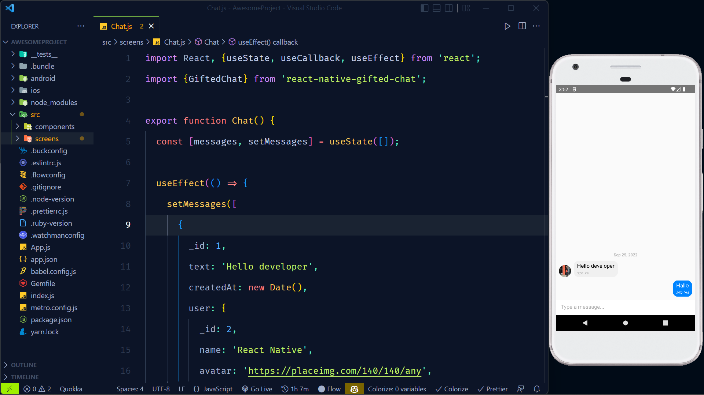

# 3rd Party Component

Selain component-component yang disediakan oleh React Native seperti button, text, view atau flatlist kita juga dapat menggunakan component yang dibuat oleh komunitas atau 3rd party component.

Misalnya component google maps, custom icons, UI components, routing dan lainnya.

Instalasi :

`> yarn add react-native-gifted-chat`

 

