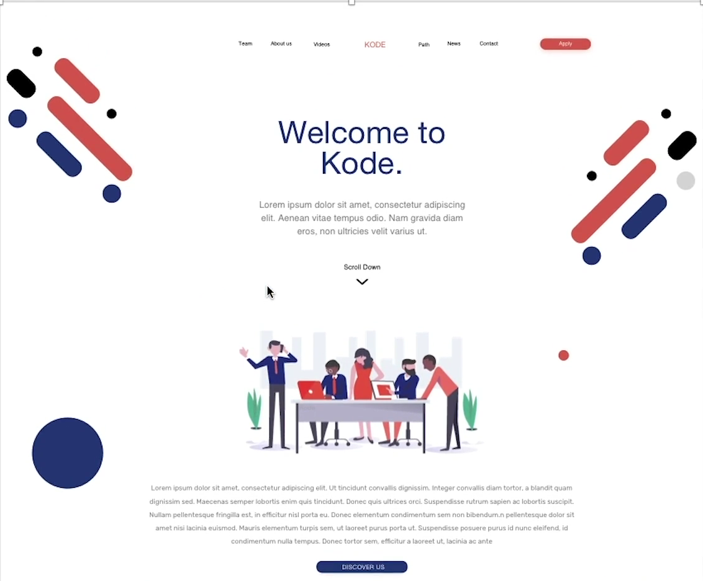
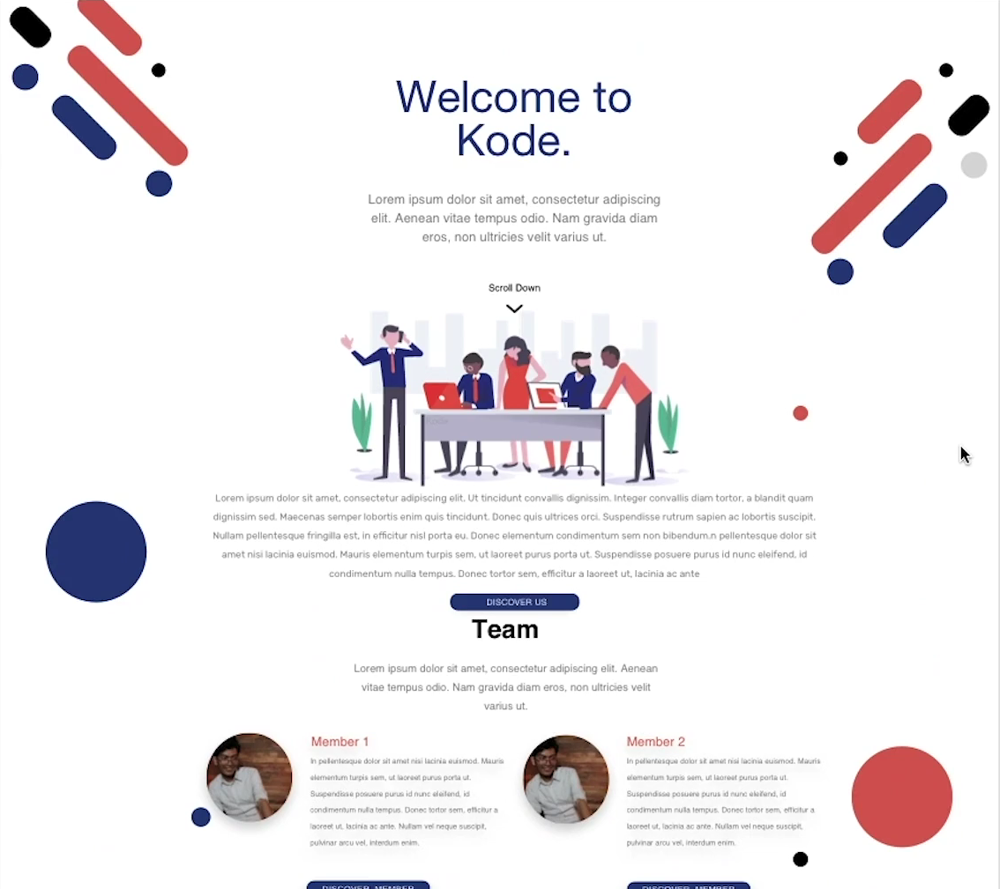

## Spacing and Layout

Spacing dan layout sangat penting untuk user experience, dengan adanya spacing dan layout user dapat melihat bagian mana saja pada setiap elemen di section tersebut.

- Spacing. Gunakan white space seperti `margin` dan `padding` untuk membuat pemisah antara elemen yang lain. Selain itu, dalam penggunaan white space jangan terlalu banyak dan juga tidak terlalu sedikit.

    

  Spacing Good ✓

   

    

  Spacing not Good X

   
